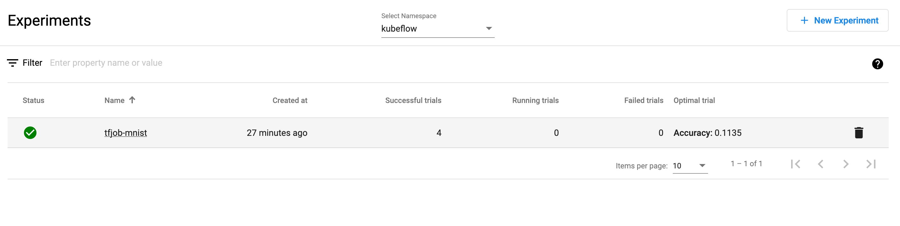
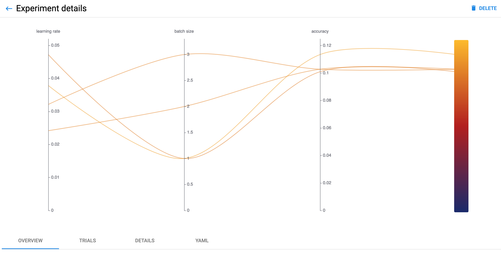
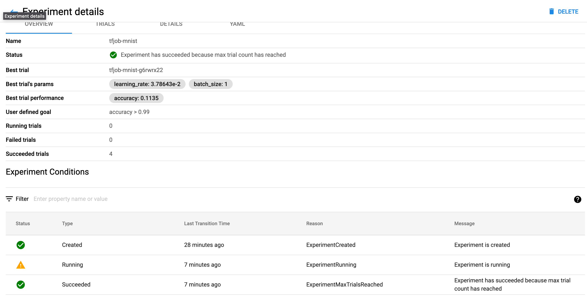

# Tuning and Training Tensorflow/Keras Deep Learning Models using Kubeflow/TFJob and Kubeflow/Katib on Kubernetes clusters
This repo shows how to train a model on CPU instances in a Kubernetes cluster by using Kubeflow/TFJob training operator and Kubeflow/Katib and a Deep Learning Container. 

TFJob is the Kubeflow implementation of Kubernetes custom resource that is used to run (distributed) TensorFlow training jobs on Kubernetes.

Katib is a Kubernetes-native project for automated machine learning (AutoML). Katib supports Hyperparameter Tuning, Early Stopping and Neural Architecture Search.


This tutorial guides you through tuning and training a classification model on the MNIST dataset with Keras in a single node CPU instance running containerized training modules (Keras framework).

This work forms the first step in building out training and inference workflows with Argo. 


1. Create Kind cluster with Kubernetes v1.25.2
```
kind create cluster --config kind-config.yaml
echo -e "\nKind cluster has been created\n"
```

2. Set context for kubectl
```
kubectl config use-context kind-kind
```

3. set up minio and create bucket for argo workflows
```
kustomize build | kubectl apply -f -
kubectl port-forward svc/minio 9999:9001
http://localhost:9999
```

3. Training Operators
Deploy TFJob operator standalone 
```
kubectl apply -k "github.com/kubeflow/training-operator/manifests/overlays/standalone?ref=v1.5.0"
```

4. Hyperparameter Tuning
Deploy Katib standalone components.
```
echo -e "\nDeploying Katib components\n"
kubectl apply -k "github.com/kubeflow/katib.git/manifests/v1beta1/installs/katib-standalone?ref=master"
```

5. Containerize the MNIST classifier code. Build and push the docker image to ECR by running ```./build-and-push.sh``` in the the mnist folder.


6. To start training, deploy the TFJob configuration file using kubectl.
```
kubectl apply -f pv.yaml
kubectl apply -f pvc.yaml
kubectl apply -f tf-job.yaml
```

7. Watch the training process
```
kubectl describe tfjob tensorflow-training
kubectl logs --follow tensorflow-training-worker-0
kubectl logs po/tensorflow-training-worker-0
```

8. To remove the TFJob and associated pods
```
kubectl delete tfjob tensorflow-training
```

9. Get a shell to the container 
```
kubectl exec --stdin --tty tensorflow-training-worker-0 -- /bin/bash
```

10. Run Katib Experiment
Create Hyperparameter Tuning Katib Experiment with random search algorithm using kubectl:
```
kubectl create -f example2.yaml 
```

The Experiment runs twelve training jobs (Trials) and tunes the following hyperparameters:

    Learning Rate (lr).
    Batch size (batch-size).

After creating above example, check the Experiment status:
```
$ kubectl get experiment tfjob-mnist -n kubeflow
```

Check the Suggestion status:
```
$ kubectl get suggestion -n kubeflow
```

Check the Trials statuses:
```
$ kubectl get trial -n kubeflow
```

To see the logs of each trial:
```
kubectl logs --follow  random-example-2rmwkwx6-hkdwb -n kubeflow -c metrics-logger-and-collector
```

You can get the best hyperparameters with the following command:
```
$ kubectl get experiment tfjob-mnist -n kubeflow -o jsonpath='{range .status.currentOptimalTrial.parameterAssignments[*]}{.name}: {.value}{"\n"}{end}'

learning_rate: 0.03786431590246644
batch_size: 1

```
Port-forward to the katib UI
```
kubectl port-forward svc/katib-ui  8080:80 -n kubeflow
xdg-open http://localhost:8080/katib
```

## View the active experiments in the UI


## View the hyperparameter tuning experiment results


## View the hyperparameter tuning experiment details



# Using Argo workflows with Katib
1. Install Argo workflows
```
kubectl create namespace argo
kubectl apply -n argo -f https://github.com/argoproj/argo-workflows/releases/download/v3.1.3/install.yaml
```


